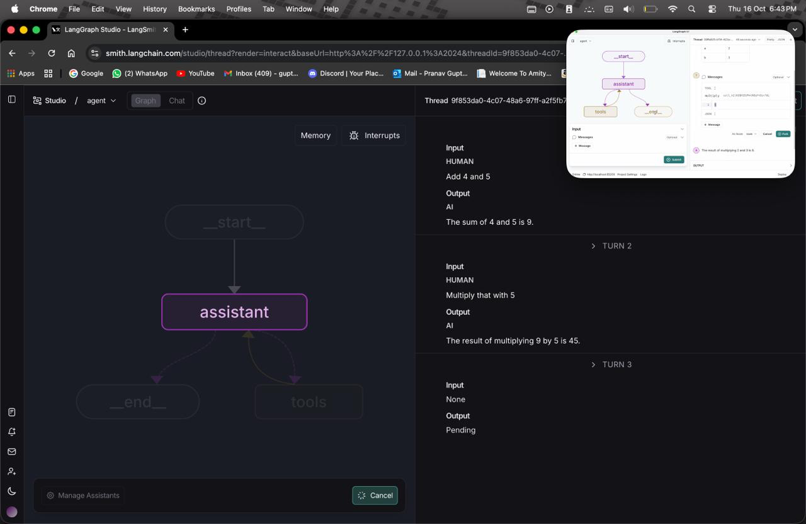

# PranavGupta_langgraph_MAT496

## Setup
- Setting up vs code for the langgraph project.
- Pasting commands from the given readme file in the github to download the neccesary libraries.

# Module 0
- It explains the basic setup required for the langgraph further
- It has the information regarding the different fields of chat models such as their temperature(Randomness), stream(stream chunks of response), invoke.

# Module 1
## Lesson 1: Motivation
- LLM uses control flow. (very reliable as same path taken every time)
- ⁠Agent is a control flow determined by an LLM.
⁠- When we go from a simple agent (router) to complex (autonomous) the application reliability decreases and the level of control increases. (as the randomness for the autonomous is much more than simple agent)
- ⁠We can balance reliability with langgraph according to our need.
- Langgraph comes with an IDE which helps you visulaise and debug the agents that you build.

## Lesson 2: Simple graph
- Learning how to build a simple graph with 3 nodes.
- State is the path between the nodes and edges of the graph.
- Edges are interconnected through nodes
- In the given example we use if statement to choose between node 2 and 3.
- When the invoke command is called it starts the graph from _START_ then traverses through node 1 in the given example, makes a choice between 2 or 3 and the _END_
- In the **tweaks** i have tried making a bigger graph using the same exact logic.

## Lesson 3: LangSmith Studio
- LangSmith Studio allows you to set up, view, and test your agents in an interactive environment.
- In the Threads section of the Studio, you can monitor and trace different runs of your graphs.
- You can also add multiple inputs to the graph state to create and connect various nodes, building the complete graph structure.

## Lesson 4: Chain
- We create a basic process where chat messages are used, the AI model talks back, we connect tools to the AI, and the AI can use those tools while running the process.
- We can give a bunch of messages to the chat AI for it to read and respond.
- To link our chat AI to an external tool like an API, we need to give it a set of information to work.
- Reducers let you attach or combine new messages into your chat.
- In the **tweaks** I have made changes in the given datasets used my own questions and prepared a different tool and then integrated into the chat model.

## Lesson 5: Router
- A **router** is like a simple agent that decides whether the AI should just reply with an answer or call a tool to get more info.
- The **conditional edge** checks what the AI’s output is — if it’s asking to use a tool, it sends the flow to the tool node; if not, the process ends there.
- In the **tweaks** I have made changes in the given datasets used my own questions and prepared a different tool and then integrated into the chat model.

## Lesson 6: Agent
- We can make the router work like a general-purpose agent that handles different kinds of tasks.
- The model can either stop after giving an answer or take the tool’s result and continue the conversation.
- In the demo video, they showed the agent making three tool calls one after another.
- You can track your project in LangSmith, which shows each step and process in detail — including things like how long it took (latency) and how many tokens were used.

## Lesson 7: Agent-memory
- We added memory to our agent so it can remember things during a conversation.
- The state only lasts while one run of the graph is happening — it resets after that.
- The graph controls how everything flows — it connects different steps (nodes) and the paths between them (edges).
- Each step that happens one after another is called a superstep, and steps that happen at the same time share the same superstep.
- Checkpoints save the graph’s progress at every stage, so you can see what happened at each step.
- A thread is just a bunch of these checkpoints grouped together — like a full record of one run.
- When the LLM needs to use a tool, it sends a tool call to the tools node. The tool runs, sends back its result, and the AI then turns that result into a natural, human-like response.
 

# Module 2
## Lesson 1: State Schema
- Got hands-on with state management in LangGraph using TypedDict, dataclass, and Pydantic.
- Learned how to define the structure of data so nodes can read and update it easily.
- Understood the difference between just hinting types and actually validating data at runtime.
- Built a simple graph where the agent makes decisions based on current state.

## Lesson 2: State Reducers
- Learned how reducers help manage state updates in LangGraph, especially when multiple nodes try to change the same data at once.
- Tried out built-in reducers like add_messages and operator.add, and also created custom reducers to handle special cases like empty values.
- Practiced updating state in different ways: appending data, overwriting duplicates, and removing messages.
- Understood how reducers make state changes clear, predictable, and conflict-free in graphs with branching or parallel nodes.
- Tweaks included modifying the graph, conditional updates based on state values.

## Lesson 3: Multiple Schemas
- So from this lesson, I understood that it’s about using multiple schemas in LangGraph.
- Normally, every node in the graph shares one main schema for inputs and outputs.
- But sometimes, we might need to pass around some extra or internal data that isn’t part of the main result.
- For that, we can create a private state just for communication between certain nodes.
- It basically helps keep things neat and organized — the main schema handles only the important inputs and outputs, and the private one deals with the background stuff.
- Tweaks included state with extra fields, multi branch grph, conditional logic in reducer, printing the values.

## Lesson 4: Trim & Filter messages
- Learned how chatbots handle long conversations without forgetting key points.
- Understood how to cut down unnecessary messages to make chats shorter and faster.
- Explored how graph states store and pass information between parts of a chatbot.
- Studied how to combine old and new chat data using custom reducers.
- Used LangSmith to check how the chatbot processes and remembers messages.
- Overall, this lesson taught how to keep the chatbot’s memory clean, focused, and efficient.
- Tweaks, revised dataset with different tone, trimming function with different name, selective filter function, combine both filters and trimmer.

## Lesson 5: Chatbot with message summarization
- The lesson showed how a chatbot can remember past chats by summarizing them instead of saving everything word for word.
- It explained how this idea helps the chatbot keep track of the conversation smoothly without using too many resources.
- Using LangChain and LangGraph made it easier to see how memory and flow are handled behind the scenes.
- The concept of summarization also made the chatbot’s replies feel more natural and connected over long conversations.
- Overall, it gave a clearer idea of how chatbots can be made smarter, faster, and more human-like just by managing memory better.
- Tweaks example chat data taken, updated variable names.

## Lesson 6: Chatbot with message summarization and external DB memory
- Chatbot stores conversation history in a database like SQLite for long-term memory.
- Memory remains intact even after the chatbot restarts.
- Important details are saved and accessed later using LangGraph checkpointers.
- Summarization of messages helps keep context while saving resources.
- Enhances chatbot’s consistency, reliability, and ability to understand conversations over time.
- Tweaks detailed docstrings, clearer variable names, and better error handling, new helper function.

# Module 3
## Lesson 1: Streaming
- Learned how streaming responses work in LangGraph and how conversation flow can be paused or interrupted during execution.
- Understood how threads and configurations are used to manage chat-based workflows.
- Changed the example prompt from Multiply 2 and 3 to Multiply 4 and 5

## Lesson 2: Breakpoints
- From this lesson, I understood that breakpoints let us stop a graph at certain nodes to inspect what’s happening while it runs.
- It helps to check intermediate outputs, understand data flow, and fix issues without running the entire graph again.
- The notebook showed how to set and use breakpoints using the client, continue execution after pausing, and review the state in between.
- Overall, I learned how breakpoints make debugging and testing in LangGraph much easier and more controlled.

## Lesson 3: Editing state and human feedback
- In this lesson, I learned that LangGraph lets us make changes to a graph’s state using human feedback.
- We can update things like node outputs or messages without having to run the whole graph again.
- It’s a simpler way to fix mistakes or adjust the output as we go.
- This makes debugging and improving the graph much quicker and easier to manage.

## Lesson 4: Dynamic breakpoints
- I learned that dynamic breakpoints allow us to pause a graph based on certain conditions instead of fixed points.
- I learned that dynamic breakpoints allow us to pause a graph based on certain conditions instead of fixed points.
- This helps in analyzing and debugging exactly where issues might occur during execution.
- It gives more control over how and when the graph pauses, making testing more efficient and flexible.
- Tweaks: Changes in variable. Pranav=World.

## Lesson 5: Time-Travel
- I learned that time travel lets us go back to a previous state of the graph.
- It helps in reviewing or re-running the graph from an earlier point without starting everything from scratch.
- This feature is useful for debugging, testing different paths, or understanding how changes affect the flow.
- It gives better control over experimentation and makes working with graphs more efficient.
**Tweaks**:Changed the example prompt from Multiply 2 and 3 to Multiply 4 and 5

# Module 4 
## Lesson 1: Parallelisation
- I learned that parallelization lets different parts of a graph run at the same time instead of one after another.
- It showed how we can “fan out” tasks to work separately and then “fan in” the results to bring everything together smoothly.
- This makes the whole process a lot faster and more organized, especially when using multiple agents or handling bigger tasks.
- Overall, it helped me really see how LangGraph manages several things at once without messing up the final output.